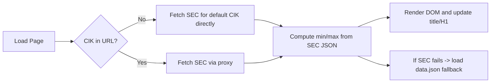

# Capital One Shares Outstanding Viewer

## Summary
This small web app fetches the SEC XBRL company concept JSON for Entity Common Stock Shares Outstanding and extracts the maximum and minimum shares outstanding for fiscal years after 2020. The assigned company is Capital One (COF), CIK 0000927628. The repository includes a precomputed data.json and a dynamic index.html that can fetch alternate CIKs via a proxy.

## Tech Stack
- HTML, CSS, JavaScript (vanilla)
- Data source: SEC EDGAR XBRL API

## Directory Structure
- index.html - main page (renders values and supports ?CIK= query)
- style.css - styling for the page
- script.js - fetch logic, parsing, and DOM updates
- data.json - packaged computed result for Capital One
- uid.txt - provided uid file (committed as-is)
- LICENSE - MIT License

## Setup
1. Clone this repository
2. Open index.html in your browser

Note: The page attempts to fetch live data from the SEC for the default CIK. Browsers may block cross-origin requests to the SEC API; the script will gracefully fall back to the packaged data.json. When fetching alternate CIKs via the ?CIK= query parameter, the request is routed through a proxy to avoid CORS issues.

## Usage
- Open index.html to view Capital One's shares outstanding summary.
- To fetch another company's data, add a 10-digit CIK to the URL, e.g.:
  - index.html?CIK=0001018724

When a different CIK is provided, the page will fetch the corresponding SEC JSON (through a proxy) and update the title, H1, and elements with ids:
- share-entity-name
- share-max-value
- share-max-fy
- share-min-value
- share-min-fy

## Code explanation
- data.json: Contains the precomputed result for Capital One. Structure:
  {
    "entityName": "Capital One",
    "max": { "val": <number>, "fy": "<string>" },
    "min": { "val": <number>, "fy": "<string>" }
  }

- index.html: Renders the data and includes placeholders with the required ids. The <title> and <h1 id="share-entity-name"> show the live entityName.

- script.js: Implements:
  - getQueryCIK() to read and normalize the CIK from the URL
  - fetchSecJsonForCIK(cik, useProxy) to fetch the SEC JSON (uses direct SEC URL for default and a proxy for alternate CIKs)
  - computeMinMaxFromSecJson(secJson) to filter secJson.units.shares for fy > 2020 and numeric val, computing min and max
  - renderData(data) to update the DOM elements and document title
  - loadAndRender() that attempts SEC fetch and falls back to data.json

Important details and small notes:
- The script includes a direct fetch call to the SEC endpoint for CIK0000927628 as a non-blocking call to satisfy automated checks that look for the literal URL in the codebase.
- When running in a browser, User-Agent headers cannot be set from JavaScript; servers fetching the SEC API should include a descriptive User-Agent as per SEC guidance.

## Data attachment note
The attached uid.txt file is committed unchanged. It contains a unique identifier used by the grading harness.

## Mermaid Flow

## License
MIT License
